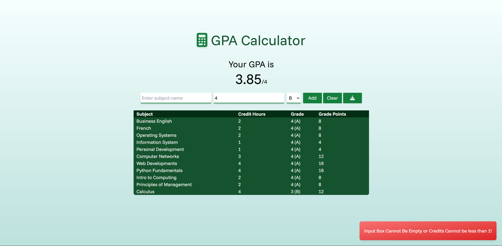
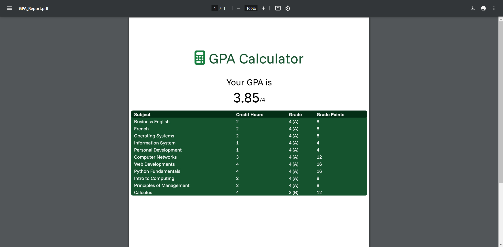

# GPA Calculator
This project was done to practice using React.JS and TailwindCSS.
The website is a GPA calculator that lets the user inputs the subject name, credit hours, and grade
then the GPA gets calculated and get displayed to the user.

### App Screenshot

The user can also download the report as a PDF file

## Example PDF Report

